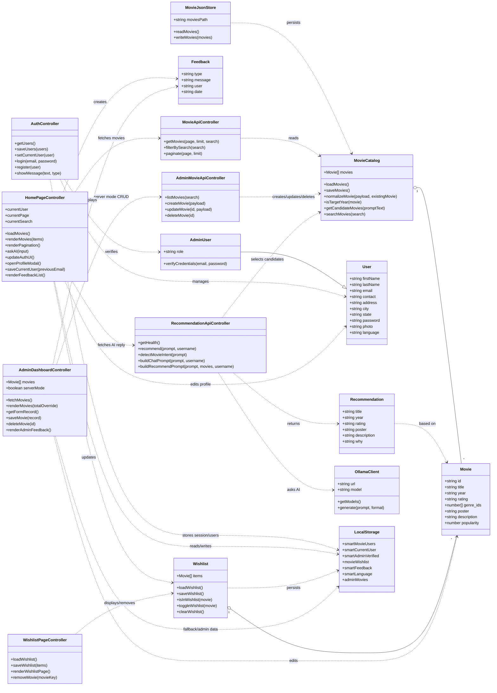

# Smart Movie Recommendation - Class Diagram

This project is written mostly with JavaScript functions and browser modules, not formal JavaScript `class` declarations. The diagram below models the main conceptual classes, data objects, controllers, and services used by the application.

## Main implementation mapping

- `server.js`: `MovieCatalog`, `MovieApiController`, `AdminMovieApiController`, `RecommendationApiController`, `MovieJsonStore`, `OllamaClient`
- API endpoints: `/api/movies`, `/api/admin/movies`, `/api/admin/movies/:id`, `/api/health`, `/api/recommend`
- `public/script.js`: `HomePageController`, profile settings, wishlist panel, AI chat UI
- `public/auth.js`: `AuthController`, `User`, `AdminUser`
- `public/wishlist.js`: `WishlistPageController`, wishlist storage
- `public/admin-dashboard.js`: `AdminDashboardController`, admin movie CRUD UI, feedback display
- `data/movies.json`: stored `Movie` records
